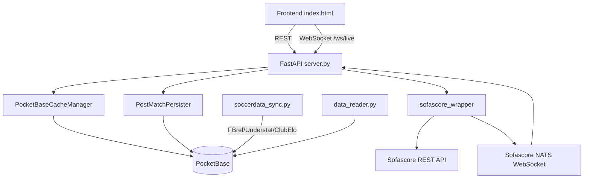

# Tài liệu kỹ thuật phát triển tiếp

Ngày rà soát: 2026-05-28

## 1. Mục tiêu tài liệu

Tài liệu này ghi lại hiện trạng codebase `sofascore-wrapper` để đội phát triển tiếp có thể nắm nhanh:

- Kiến trúc tổng thể và luồng dữ liệu.
- Các tính năng hiện đã có.
- Những phần đã làm được, chưa làm được, rủi ro kỹ thuật và hướng ưu tiên tiếp theo.

Codebase hiện không chỉ là Python wrapper cho Sofascore nữa. Repo đang có thêm một demo server FastAPI, cache PocketBase, realtime gateway, frontend HTML và các script thử nghiệm đồng bộ dữ liệu bóng đá từ nhiều nguồn.

## 2. Tóm tắt hiện trạng

Repo gồm 2 khối chính:

1. `sofascore_wrapper/`: thư viện async Python gọi API không chính thức của Sofascore.
2. `sofascore-demo-server/`: ứng dụng demo dùng thư viện wrapper, thêm FastAPI, WebSocket realtime, cache PocketBase, frontend một file HTML và các script đồng bộ dữ liệu.

Ngoài ra còn có các script chạy thử ở root như `diagnostic.py`, `test_fixtures.py`, `test_match_details.py`, `test_player_stats.py`, `test_ss.py`, `pocketbase_sync.py` và các file JSON mẫu.

Kiểm tra cú pháp đã chạy:

```bash
python -m compileall sofascore_wrapper sofascore-demo-server diagnostic.py pocketbase_sync.py tests.py test_fixtures.py test_match_details.py test_player_stats.py test_ss.py
```

Kết quả: tất cả file Python compile được.

## 3. Cấu trúc thư mục

```text
sofascore_wrapper/
  api.py                  Core HTTP client, HTTPX + Playwright fallback
  token_manager.py        Lấy cookie/user-agent/token qua Playwright
  realtime_client.py      NATS WebSocket client của Sofascore
  search.py               Tìm kiếm all/match/player/team/league
  match.py                Football match endpoints
  team.py                 Team profile, fixtures, squad, transfers, stats
  league.py               League seasons, standings, top players/teams, fixtures
  player.py               Player search/profile/stats/attributes
  basketball.py ...       Các sport-specific wrapper
  tools/enums.json        Mapping sport slug/id

sofascore-demo-server/
  server.py               FastAPI REST + WebSocket gateway
  cache_manager.py        Cache-first layer trên PocketBase
  post_match_persister.py Persist live score và dữ liệu sau trận
  data_reader.py          Unified read layer đọc dữ liệu đã merge từ PocketBase
  init_pb.py              Khởi tạo schema PocketBase bằng HTTP API
  soccerdata_sync.py      Sync FBref/Understat/ClubElo qua soccerdata
  index.html              Frontend demo realtime/search/team/player modal
  pb/
    pocketbase.exe        PocketBase binary local
    pb_data/              Local DB/logs/types
    pb_migrations/        Schema migrations hiện tại

root scripts/data:
  diagnostic.py           Script diagnostic endpoint wrapper
  diagnostic_results.json Snapshot kết quả diagnostic cũ
  pocketbase_sync.py      Script sync JSON mẫu, schema cũ hơn init_pb.py
  test_*.py, tests.py     Script thủ công, không phải test suite chuẩn
  arsenal_*.json,
  match_*.json,
  raw_match_data.json     Dữ liệu mẫu/generated output
```

## 4. Kiến trúc tổng thể



### 4.1 Core wrapper

`SofascoreAPI` trong `sofascore_wrapper/api.py` là client trung tâm. Các class domain như `Search`, `Team`, `Player`, `Match`, `League` nhận instance `SofascoreAPI` rồi gọi `_get()` hoặc `_raw_get()`.

Luồng request:

1. `_get(endpoint)` ghép URL từ `https://www.sofascore.com/api/v1`.
2. `_request_with_fallback()` thử HTTPX trước, dùng cookie/user-agent từ `TokenManager`.
3. Nếu gặp 403/429 hoặc lỗi session, force refresh session qua Playwright rồi thử HTTPX lần hai.
4. Nếu vẫn lỗi, fallback mở URL bằng Chromium headless và parse JSON từ response.

`TokenManager` là singleton. Nó mở Sofascore bằng Playwright để lấy cookies, user-agent và nếu có thì websocket token. Hiện comment trong code cho biết Sofascore đã chuyển sang NATS nên token có thể là `"none"`, TTL cookie giả lập 1 giờ.

### 4.2 Realtime

`SofascoreRealtimeClient` trong `sofascore_wrapper/realtime_client.py` kết nối tới:

```text
wss://ws.sofascore.com:9222/
```

Client gửi command NATS dạng text (`CONNECT`, `SUB`, `PING/PONG`), quản lý `sid`, tự reconnect bằng exponential backoff và gọi callback theo channel. Server demo hiện subscribe cố định `sport.football`.

### 4.3 FastAPI demo server

`sofascore-demo-server/server.py` tạo app FastAPI có lifespan:

- Khởi tạo `SofascoreAPI`.
- Khởi tạo `SofascoreRealtimeClient`.
- Khởi tạo `PostMatchPersister`.
- Subscribe channel `sport.football`.
- Broadcast event tới client WebSocket `/ws/live`.
- Cập nhật live score vào PocketBase.
- Nếu status kết thúc trận, chạy persist full post-match data.

REST endpoints hiện có:

| Endpoint | Chức năng | Cache-first |
| --- | --- | --- |
| `GET /` | health/info | Không |
| `GET /api/search?q=&sport=` | tìm team/player/match/league | Có, teams/players |
| `GET /api/match/{match_id}/stats` | match statistics | Chưa |
| `GET /api/match/{match_id}/commentary` | live text/commentary | Chưa |
| `GET /api/team/{team_id}` | team profile | Có |
| `GET /api/team/{team_id}/transfers` | transfers in/out | Có |
| `GET /api/team/{team_id}/players` | squad | Có |
| `GET /api/player/{player_id}` | player profile + attributes | Có |
| `GET /api/league/{league_id}/standings?season=` | standings | Có |
| `WS /ws/live` | realtime score gateway | Không áp dụng |

### 4.4 PocketBase cache và database

PocketBase được giả định chạy ở:

```text
http://127.0.0.1:8090
admin@sofascore.local / Admin123456789
```

`cache_manager.py` dùng PocketBase SDK và fallback auth bằng HTTPX. Cache hiện có cho:

- `teams`: profile, logo local file, raw Sofascore JSON, TTL.
- `players`: basic/full profile, attributes, avatar local file, TTL.
- `squads`: raw squad JSON, TTL.
- `team_transfers`: raw transfer JSON, TTL.
- `leagues`: standings + metadata + logo local file, TTL.

Các migrations trong `sofascore-demo-server/pb/pb_migrations/` đang định nghĩa schema mở rộng gồm:

- `leagues`
- `seasons`
- `teams`
- `players`
- `squads`
- `team_transfers`
- `matches`
- `match_events`
- `match_lineups`
- `player_season_stats`
- `team_season_stats`
- `shot_events`
- `club_elo_history`

`init_pb.py` cũng định nghĩa schema tương tự bằng Python. Hiện cần chọn một nguồn schema canonical để tránh lệch giữa script và migrations.

### 4.5 Persist sau trận

`post_match_persister.py` có hai vai trò:

- `LiveScoreUpdater`: upsert score/status realtime vào `matches`.
- `PostMatchPersister`: khi trận kết thúc, gọi song song:
  - `Match.stats()` để patch stats vào `matches`.
  - `Match.incidents()` để insert `match_events`.
  - `Match.lineups_home()` và `lineups_away()` để insert `match_lineups`.
  - `_persist_match_core()` để ghi thông tin cơ bản từ raw NATS event.

Upsert ID dùng SHA-256 cắt 15 ký tự để phù hợp PocketBase record id.

### 4.6 Unified read layer

`data_reader.py` là lớp đọc dữ liệu từ PocketBase theo hướng "client chỉ gọi một API nội bộ":

- `FootballDataReader.get_match()` lấy record `matches`, attach `match_events`, `match_lineups`, `shot_events` nếu cần.
- `get_team_matches()` đọc lịch sử/lịch thi đấu theo team.
- `get_player_stats()` merge nhiều dòng `player_season_stats` từ FBref/Understat/Sofascore/WhoScored theo priority.
- `get_player_stats_by_source()` phục vụ debug/compare.
- `get_league_table()` enrich standings bằng ClubElo.

Đây là hướng kiến trúc tốt cho giai đoạn sau, nhưng hiện chưa được expose qua FastAPI.

### 4.7 Offline/multi-source sync

`soccerdata_sync.py` đồng bộ dữ liệu qua package `soccerdata`:

- FBref: schedule, player season stats, team season stats.
- Understat: player xG/xA/xGChain/xGBuildup, shot events.
- ClubElo: lịch sử Elo theo team.

`LEAGUE_MAP` hiện map các giải lớn từ Sofascore ID sang FBref/Understat slug. `DEFAULT_SEASON = "2025"` tương ứng mùa 2024/25 theo convention của soccerdata.

`pocketbase_sync.py` ở root là script cũ hơn, dùng file JSON mẫu Arsenal và schema khác (`source_id`, `source`) so với schema mới (`sofascore_id`, cross-source ids). Nên xem nó là prototype/historical script, không phải luồng sync chính.

## 5. Tính năng hiện tại

### 5.1 Wrapper Sofascore

Đã có wrapper async cho nhiều nhóm:

- Football core: search, match, team, league, player, manager, transfers, news, user data.
- Realtime NATS client.
- Sport-specific modules: basketball, baseball, cricket, tennis, rugby, ice hockey, esports, MMA, motorsport, american football.
- Image URL helpers cho team/player/flag/tournament.

Các method chủ yếu trả raw JSON từ Sofascore, ít transform sang model nội bộ.

### 5.2 Demo API/cache

Đã có server REST để frontend hoặc client khác dùng:

- Search cache-first cho team/player.
- Team info cache-first, có tải logo về PocketBase file storage.
- Team transfers cache-first.
- Team squad cache-first, đồng thời parse basic players vào `players`.
- Player detail cache-first; nếu chỉ có basic cache thì fallback gọi Sofascore để lấy attributes.
- League standings cache-first; tự lấy current season nếu không truyền.

### 5.3 Realtime dashboard

`index.html` có:

- Kết nối `ws://127.0.0.1:8000/ws/live`.
- Hiển thị card live score, flash animation khi score đổi.
- Search team/player qua REST.
- Modal chi tiết team, squad, transfers.
- Modal profile player với attributes dạng thanh chỉ số.
- Cache phía frontend bằng `Map` với TTL 10 phút.

### 5.4 Data persistence

Đã có nền tảng lưu dữ liệu dài hạn:

- PocketBase migrations.
- Local PocketBase binary và `pb_data`.
- Cache TTL cho dữ liệu team/player/squad/transfers/league.
- Persist live score và post-match events/stats/lineups.
- Prototype merge dữ liệu multi-source trong `data_reader.py`.

### 5.5 Diagnostic/sample scripts

Các script đang giúp lấy dữ liệu mẫu:

- `diagnostic.py`: gọi nhiều endpoint wrapper và ghi `diagnostic_results.json`.
- `test_fixtures.py`: lấy fixtures Arsenal tháng 5/2026.
- `test_match_details.py`: lấy raw + parsed match detail.
- `test_player_stats.py`: tìm và in profile/stats cầu thủ.
- `test_ss.py`: lấy FBref squad Arsenal bằng soccerdata.

Lưu ý: đây là script thủ công, không phải test suite tự động.

## 6. Những gì đã làm được

- Core wrapper compile được và có phạm vi endpoint rất rộng.
- Đã xử lý vấn đề Sofascore chặn REST bằng chiến lược HTTPX + cookies + Playwright fallback.
- Đã có `TokenManager` singleton, giảm việc refresh session trùng lặp trong một process.
- Đã có realtime client tự reconnect và subscribe NATS channel.
- Đã có FastAPI server làm gateway REST/WebSocket.
- Đã áp dụng nguyên tắc cache-first ở các route quan trọng: search, team, transfer, squad, player, league standings.
- Đã có PocketBase schema đủ rộng cho football data warehouse: teams, players, matches, events, lineups, season stats, shots, Elo.
- Đã có logic tải logo/avatar về PocketBase file storage để giảm phụ thuộc asset Sofascore khi trả dữ liệu cache.
- Đã có hướng multi-source data: Sofascore live + FBref/Understat/ClubElo offline.
- Đã có frontend demo có thể thao tác trực tiếp với REST/WebSocket local.
- `diagnostic_results.json` ghi nhận nhiều endpoint từng chạy được: search, seasons, standings, top players/teams, team info/transfers/fixtures, match live/games_by_date/stats/commentary/lineups. Snapshot này có 22 mục working và 2 mục failed, nhưng cần chạy lại vì một lỗi trong snapshot không khớp chữ ký current code.

## 7. Những gì chưa làm được hoặc còn rủi ro

### 7.1 Chưa có test suite chuẩn

Repo chưa có pytest/unittest thực sự. Các file `test_*.py` là script có side effect, phụ thuộc network, Sofascore, soccerdata, Playwright và đôi khi ghi file JSON ra root. Chưa có mocked tests cho:

- HTTP client/fallback.
- Cache hit/miss.
- PocketBase upsert.
- NATS parser.
- FastAPI routes.

### 7.2 Cấu hình và secret đang hard-code

Nhiều file đang hard-code:

- `PB_URL = "http://127.0.0.1:8090"`
- `admin@sofascore.local`
- `Admin123456789`
- `API_BASE = "http://127.0.0.1:8000"`
- `WS_BASE = "ws://127.0.0.1:8000/ws/live"`

Điều này chưa phù hợp production hoặc share repo. Cần chuyển sang `.env`/environment variables và cập nhật `.gitignore`.

### 7.3 Schema chưa thống nhất

Có ít nhất 3 nguồn schema:

- `sofascore-demo-server/pb/pb_migrations/` là schema đang được PocketBase dùng.
- `sofascore-demo-server/init_pb.py` định nghĩa schema bằng Python.
- `pocketbase_sync.py` định nghĩa schema cũ hơn với field `source_id`, `source`.

Nếu tiếp tục phát triển, cần chọn một nguồn sự thật. Khuyến nghị dùng migrations làm canonical, rồi sửa script sync để theo migrations.

### 7.4 Packaging chưa phản ánh app mới

`setup.py` chỉ khai báo dependency `playwright>=1.42.0`. Trong khi code hiện dùng thêm:

- `httpx`
- `websockets`
- `fastapi`
- `uvicorn`
- `pocketbase`
- `soccerdata` cho sync script

`requirements.txt` có một phần các dependency server nhưng chưa có `soccerdata`. Nếu package publish lên PyPI, phần demo-server không được mô tả rõ là optional extra hay dev tool.

### 7.5 Error handling còn thô

Nhiều nơi đang `print()` lỗi rồi raise hoặc trả `None`. Chưa có structured logging, retry policy chuẩn, error type riêng hoặc correlation id. FastAPI routes hầu hết bọc exception thành HTTP 500 với raw string.

### 7.6 API shape chưa có contract ổn định

Wrapper chủ yếu trả raw Sofascore JSON. Server route cũng trả raw hoặc semi-normalized JSON. Chưa có Pydantic schemas cho response. Điều này làm frontend phụ thuộc trực tiếp vào shape Sofascore và dễ vỡ khi upstream đổi field.

### 7.7 Realtime parser còn đơn giản

`realtime_client.py` parse NATS message bằng split `\r\n` và giả định mỗi message chứa đủ header + payload. NATS/WebSocket có thể chunk hoặc gom nhiều frame. Nếu chạy lâu dài cần parser protocol robust hơn.

Server cũng subscribe cố định `sport.football`; chưa có API để client subscribe/unsubscribe theo match/team/league.

### 7.8 Persist post-match còn thiếu mapping và độ bền

Một số điểm cần sửa trước khi tin cậy dữ liệu:

- `_persisted_matches` chỉ là set in-memory, mất sau restart.
- `team_id` trong `match_events` và `match_lineups` đang lưu `"home"`/`"away"` ở vài chỗ, chưa resolve sang actual Sofascore team id.
- `_persist_match_stats()` flatten stats từ Sofascore nhưng chưa chuẩn hóa hết name/key và unit.
- Chưa có retry/job queue cho post-match persist nếu một endpoint lỗi.
- Chưa có trạng thái persist trong DB để biết match nào đã full, partial, failed.

### 7.9 Unified read layer chưa tích hợp vào API

`data_reader.py` có thiết kế tốt để merge dữ liệu nhiều nguồn nhưng chưa được server expose. Một số logic còn lệch với cache hiện tại, ví dụ:

- `set_league_cache()` lưu `sofascore_id` dạng `league_id_season_id`.
- `get_league_table()` lại query `sofascore_id='{league_id}'`, có thể không tìm thấy record standings theo season.

### 7.10 Frontend demo chưa được module hóa

`index.html` là một file lớn, có inline CSS/JS. Vẫn dùng hard-code local URL, chưa có build tooling, chưa có test UI. Trong `showPlayerProfile()` có đoạn code sau `return;` nên trở thành dead code. Một số text/comment trong repo có dấu hiệu mojibake/encoding lỗi từ lần lưu trước.

### 7.11 Repo đang chứa generated/binary/runtime state

Repo hiện có:

- `sofascore-demo-server/pb/pocketbase.exe`
- `sofascore-demo-server/pb/pb_data/data.db`
- `sofascore-demo-server/pb/pb_data/logs.db`
- `sofascore_wrapper/__pycache__/`
- `sofascore-demo-server/__pycache__/`
- JSON output mẫu ở root
- `downloaded_files/driver_fixing.lock`

`.gitignore` hiện chỉ ignore Python bytecode/build/egg-info. Cần quyết định file nào là fixture cần commit, file nào là runtime artifact cần ignore.

## 8. Cách chạy local hiện tại

### 8.1 Cài dependencies

```bash
pip install -r requirements.txt
python -m playwright install chromium
```

Nếu chạy `soccerdata_sync.py` hoặc `test_ss.py`, cần cài thêm:

```bash
pip install soccerdata
```

### 8.2 Chạy PocketBase

Từ root repo:

```powershell
cd sofascore-demo-server\pb
.\pocketbase.exe serve
```

PocketBase mặc định phục vụ tại `http://127.0.0.1:8090`.

### 8.3 Khởi tạo schema

Ở terminal khác, từ root repo:

```bash
python sofascore-demo-server/init_pb.py
```

Nếu dùng migrations có sẵn trong `pb_migrations`, cần kiểm tra lại quy trình migrate của PocketBase để tránh tạo lệch schema.

### 8.4 Chạy FastAPI server

Cách trực tiếp:

```bash
python sofascore-demo-server/server.py
```

Hoặc chạy uvicorn từ thư mục server:

```powershell
cd sofascore-demo-server
uvicorn server:app --host 127.0.0.1 --port 8000
```

### 8.5 Mở frontend

Mở file:

```text
sofascore-demo-server/index.html
```

Frontend đang gọi hard-code `http://127.0.0.1:8000` và `ws://127.0.0.1:8000/ws/live`.

## 9. Ưu tiên phát triển tiếp

### P0 - Làm rõ baseline và bảo mật local config

- Chuyển PB URL, admin email/password, API base, WS base sang env vars.
- Thêm `.env.example`.
- Cập nhật `.gitignore` cho `pb_data`, `__pycache__`, generated JSON nếu không muốn commit.
- Quyết định có commit `pocketbase.exe` hay chuyển sang hướng tải binary/document setup.

### P1 - Chuẩn hóa schema và data layer

- Chọn `pb_migrations/` làm canonical schema.
- Sửa hoặc loại bỏ `pocketbase_sync.py` schema cũ.
- Đồng bộ `init_pb.py` với migrations hoặc bỏ `init_pb.py` nếu migrations là nguồn chính.
- Sửa `data_reader.get_league_table()` để query đúng key `league_id_season_id` hoặc đổi cách lưu league standings.

### P1 - Tạo test suite tự động

- Thêm `pytest`, `pytest-asyncio`, `respx` hoặc mock HTTPX.
- Test `SofascoreAPI._request_with_fallback()` bằng mocked HTTP responses.
- Test cache hit/miss của `PocketBaseCacheManager` bằng fake client.
- Test FastAPI route bằng `TestClient` hoặc `httpx.AsyncClient`.
- Test NATS parser với raw messages mẫu.

### P2 - Harden realtime và persist

- Viết parser NATS theo stream buffer thay vì split đơn giản.
- Cho phép subscribe theo match/team/channel từ client.
- Lưu trạng thái persist vào DB (`pending`, `partial`, `complete`, `failed`).
- Resolve actual team id/player id trong events/lineups.
- Thêm retry/backoff/job queue cho post-match persist.

### P2 - Định nghĩa API contract

- Thêm Pydantic response models cho server.
- Chuẩn hóa response giữa cache hit và cache miss.
- Tách raw Sofascore payload khỏi normalized response.
- Thêm versioning nếu frontend sẽ phụ thuộc lâu dài.

### P3 - Frontend và developer experience

- Tách frontend thành module hoặc app nhỏ nếu sẽ phát triển UI nghiêm túc.
- Bỏ dead code trong `index.html`.
- Chuyển hard-code base URLs sang config.
- Sửa toàn bộ lỗi encoding/mojibake trong README/comment/UI text.
- Viết README mới cho 2 mode: dùng library wrapper và chạy demo app.

## 10. Kết luận kỹ thuật

Nền tảng hiện tại đã vượt khỏi một wrapper đơn giản: đã có hướng cache-first, realtime, PocketBase persistence và multi-source football warehouse. Phần đã làm được đủ để demo local và thử nghiệm dữ liệu Sofascore/FBref/Understat.

Phần chưa sẵn sàng là tính ổn định vận hành: config còn hard-code, schema chưa có một nguồn sự thật duy nhất, chưa có test suite, realtime parser còn đơn giản, post-match persist chưa idempotent bền vững qua restart, và frontend vẫn là prototype một file. Nếu tiếp tục phát triển thành sản phẩm hoặc service lâu dài, nên ưu tiên cấu hình, schema, test và API contract trước khi mở rộng thêm endpoint.
